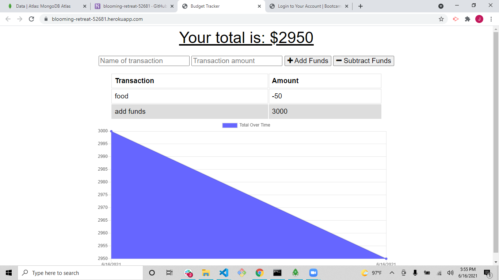

# budget-tracker-homework

Given front end code and routs created db.js file to allow app to run while online and offline.
Added access to MongoDB server and a SaveRecord function to allow functionality without an active internet connection.

https://blooming-retreat-52681.herokuapp.com/

screenshot
